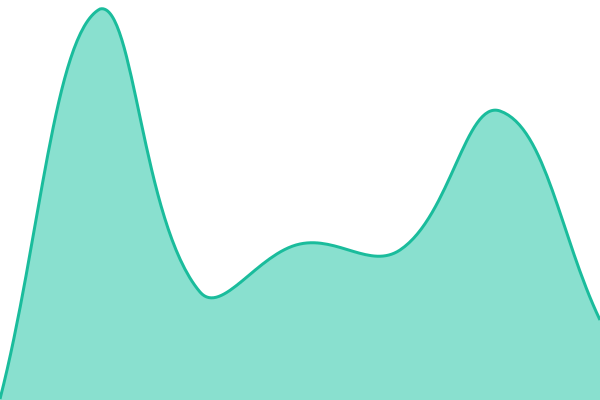
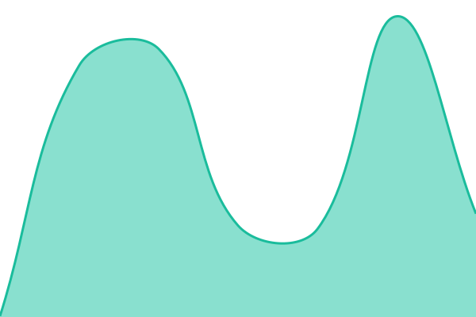

# [📈 Live Status](https://nholmes.dev): <!--live status--> **🟩 All systems operational**

This repository contains the open-source uptime monitor and status page for [Nathan Holmes](https://nholmes.dev), powered by [Upptime](https://github.com/upptime/upptime).

With [Upptime](https://upptime.js.org), you can get your own unlimited and free uptime monitor and status page, powered entirely by a GitHub repository. We use [Issues](https://github.com/nholmes-dev/status/issues) as incident reports, [Actions](https://github.com/nholmes-dev/status/actions) as uptime monitors, and [Pages](https://nholmes.dev) for the status page.

<!--start: status pages-->
<!-- This summary is generated by Upptime (https://github.com/upptime/upptime) -->
<!-- Do not edit this manually, your changes will be overwritten -->
<!-- prettier-ignore -->
| URL | Status | History | Response Time | Uptime |
| --- | ------ | ------- | ------------- | ------ |
|  [BaizeBoard](https://baizeboard.com) | 🟩 Up | [baize-board.yml](https://github.com/nholmes-dev/status/commits/HEAD/history/baize-board.yml) | 

 160ms
     
 | 

<a href="https://nholmes.dev/history/baize-board">100.00%</a>
    

|  [Off Streets On Sports](https://offstreetsonsports.com) | 🟩 Up | [off-streets-on-sports.yml](https://github.com/nholmes-dev/status/commits/HEAD/history/off-streets-on-sports.yml) | 

 201ms
     
 | 

<a href="https://nholmes.dev/history/off-streets-on-sports">100.00%</a>
    

|  [Preston Autocare LTD](https://prestonautocareltd.pages.dev) | 🟩 Up | [preston-autocare-ltd.yml](https://github.com/nholmes-dev/status/commits/HEAD/history/preston-autocare-ltd.yml) | 

 124ms
     
 | 

<a href="https://nholmes.dev/history/preston-autocare-ltd">100.00%</a>
    

|  [NH — Portfolio](https://nathanholmes.uk) | 🟩 Up | [nh-portfolio.yml](https://github.com/nholmes-dev/status/commits/HEAD/history/nh-portfolio.yml) | 

 244ms
     
 | 

<a href="https://nholmes.dev/history/nh-portfolio">100.00%</a>
    

|  [NH — Web Design](https://nhwebdesign.co.uk) | 🟩 Up | [nh-web-design.yml](https://github.com/nholmes-dev/status/commits/HEAD/history/nh-web-design.yml) | 

 198ms
     
 | 

<a href="https://nholmes.dev/history/nh-web-design">100.00%</a>
    

<!--end: status pages-->

[**Visit our status website →**](https://nholmes.dev)

## 📄 License

- Powered by: [Upptime](https://github.com/upptime/upptime)
- Code: [MIT](./LICENSE) © [Anand Chowdhary](https://anandchowdhary.com)
- Data in the `./history` directory: [Open Database License](https://opendatacommons.org/licenses/odbl/1-0/)
